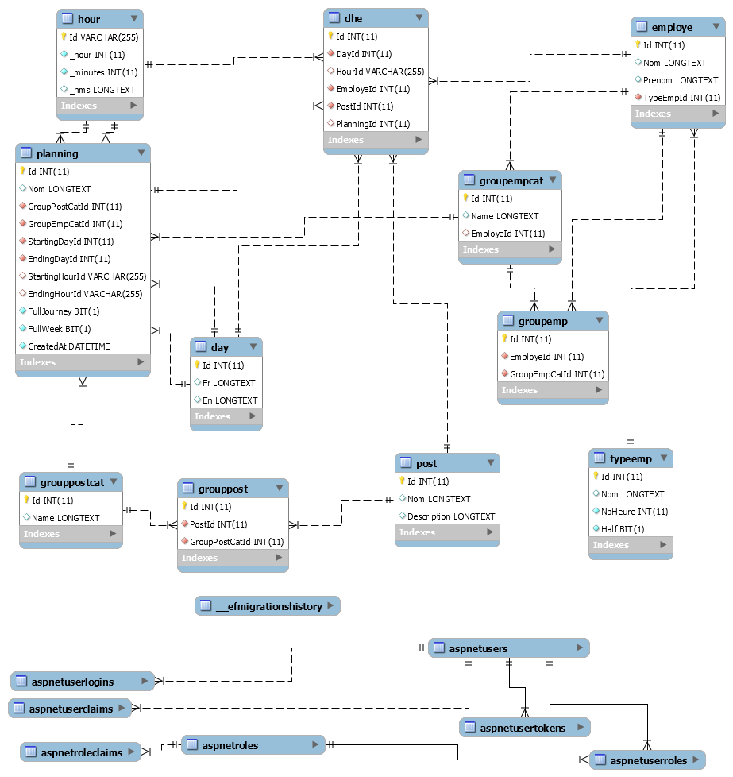

# Planning Generator / Générateur de planning
FR
## Présentation

L'application permet selon les ressources fournis(Employés, temps de travail ,poste de travail, tranche horaires/jours) de générer et attribuer de manière alétoire les employés au poste de travail en fonction de leur nombre d'heures travaillés /jour et disponibilités.

## Fonctionnalités

- Service Mail. 
- Gestion des types d'Employés (Création/Modification/Supression).
- Gestion des Employés (Création/Modification/Suppression).
- Gestion des postes de travail(position) (Création/Modification/Suppression).
- Gestion des groupes: Employés, Poste de travail.
- Création de configuration de planning.


### Objectifs
- Gérer les congés.
- Gérer les jours fériés.
- Lier les employés aux utilisateurs (Identity).
- Possibilité d'envoi groupé aux employés concerné par un planning.
- Travailler directement avec des DateTime.
- Possibilité d'exportation vers divers formats: .csv, Google Agenda, fullcalendar.io etc... 
- Modifier design.
- Création d'une app winform.
- Bien entendu fixer les bugs 😎


### Notes

L'algorithme de distribution/attribtions des "plots" se trouve dans le fichier `.../Models/Pln/EmpPostManager.cs`.

L'application étant en cours de développement: il y a donc des zones non couvertes susceptible d'être buggés comme le configuration d'un planning : tranche horaires/jours non bornés , la non vérification des valeurs vides entrés ...


## Pré-requis
- SDK .net core => 2.2
- Base de donnée Mysql (recommandé => 8.0.12) 
   
## Configuration
- Dans le fichier `appssettings.json` entrez les informations de connexion concernant l'email qui servira à l'inscription et ceux de la base de donnée:

```javascript

{
  "EmailSender": {
    "Host": "smtp.gmail.com", 
    "Port": 587,
    "EnableSSL": true,
    "UserName": "Adresse@mail.fr",
    "Password": "MotDeP@$$eeeSecurr"
  },
  "ConnectionStrings": {
    "DefaultConnection": "", 
    "LocalConnection": "Server=adresse.Du.Serveur;Database=NomDeLaBaseDeDonnée;User=Utilisateur;Password=MotDePasse;"
  }
}
```

Créez la migration de base dans l'invite de commande (dans le répétoire PlanningGenerator/PlanningGenerator) et appliquez la pour:

* Le contexte Identity (Gestion des comptes utilisateurs):
```
dotnet ef migrations add InitAppCtx --context ApplicationDbContext
dotnet ef database update --context ApplicationDbContext
```

* Le contexte des données:
```
dotnet ef migrations add InitPlnCtx --context PlnContext
dotnet ef database update --context PlnContext
```


## Bonus

### Captures
Page d'accueil:


Liste des plannings:


Exemple de génération de planning:


Autre exemple:


### Structure des données



### Libs et technos utilisés
- Twitter bootstrap 4.1.3
- Jquery 3.3.1
- Popper.js 1.14.6
- FontAwesome
- Identity
- Entity Framework

#### In English Please 
(Coming soon)
EN